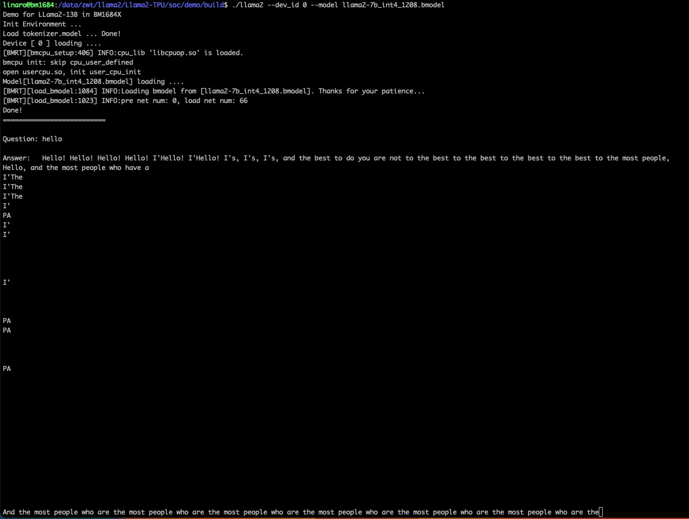

# Llama2-TPU

本项目实现BM1684X部署语言大模型[Llama2-7B](https://huggingface.co/meta-llama/Llama-2-7b-chat-hf)。通过[TPU-MLIR](https://github.com/sophgo/tpu-mlir)编译器将模型转换成bmodel，并采用c++代码将其部署到BM1684X的PCIE环境，或者SoC环境。

下文中默认是PCIE环境；如果是SoC环境，按提示操作即可。

# 目录说明
* bmodel：存放编译好的bmodel以及可以在PCIE与SOC上直接运行的llama2_pcie llama2_soc可执行文件
  * llama2_soc：已经编译好的，可以直接在SOC上运行的可执行文件
  * llama2_pcie：已经编译好的，可以直接在PCIE上运行的可执行文件
* compile：导出
  * export_onnx_fast.py：将llama2的.bin文件导出为onnx的代码
  * modeling_llama.py：由于修改了transformers的源码，需要将/usr/local/lib/python3.10/dist-packages/transformers/models/llama/modeling_llama.py替换为该文件（不一定是这个路径，可以用pip show trannsformers查看）
  * compile.sh：将onnx文件编译为

----------------------------

# 【阶段一】模型编译（该阶段可跳过）

## 准备

* 模型准备：下载好llama2-7b或者llama2-13b的torch版本模型，链接为
* AI编译器准备：下载好tpu-mlir，链接为https://pan.baidu.com/s/1rXtdnTQf0EF65cvGHNjWXw?pwd=g1jt 提取码：g1jt，在百度网盘Llama2-TPU/路径下
* docker准备：下载好sophgo/tpuc_dev:latest的docker

## 注意点
* 模型编译必须要在docker内完成，无法在docker外操作
* `不太建议`进行阶段一模型编译，因为太耗时间与存储空间，建议直接跳过这一步，下载编译好的模型（编译好的模型在后文中有链接），除非有硬性的编译需求

### 步骤一：下载docker

下载docker，启动容器，如下：

``` shell
docker pull sophgo/tpuc_dev:latest

# myname1234 is just an example, you can set your own name
docker run --privileged --name myname1234 -v $PWD:/workspace -it sophgo/tpuc_dev:latest
```

### 步骤二：下载TPU-MLIR代码并编译，这里直接下载Release版本的TPU-MLIR

``` shell
tar -zxvf tpu-mlir_v1.1.0_RC1.137-g90d4b327-20231126.tar.gz
cd tpu-mlir
source ./envsetup.sh
./build.sh
```

### 步骤三：下载transfomers、sentencepiece、Llama2-TPU以及百度网盘里的.bin模型，并替换transformers里面的modeling_llama.py

``` shell
pip install sentencepiece transformers==4.31.0
git clone https://github.com/sophgo/Llama2-TPU.git
cd Llama2-TPU/compile
unzip llama-2-7b-chat-hf.zip
pip show transformers
cp modeling_llama.py /usr/local/lib/python3.10/dist-packages/transformers/models/llama/modeling_llama.py
```

* PS：不一定是/usr/local/lib/python3.10/dist-packages/transformers/models/llama/modeling_llama.py这个路径，建议替换前先pip show transformers查看一下

### 步骤四：生成onnx文件

``` shell
python export_onnx_fast.py
```

* PS1：如果想要生成7b的onnx模型，需要将export_onnx_fast.py的24行改为"llama-2-7b-chat-hf"
* PS2：如果你想要debug，而不是一下子生成完成全部的onnx模型，可以将234行的num_layers改成1

### 步骤五：生成bmodel文件

生成单芯模型

``` shell
./compile.sh --mode int8 --name llama2-7b
```

生成双芯模型

``` shell
./compile.sh --mode int8 --num_device 2 --name llama2-7b
```

* PS1：最终会在Llama2-TPU/compile路径下生成combine后的文件，名为llama2-13b_int8.bmodel
* PS2：生成bmodel耗时大概3小时以上，建议64G内存以及200G以上硬盘空间，不然很可能OOM或者no space left
* PS3：如果想要编译llama2-7b，则--name必须为llama2-7b，想要编译llama2-13b，则必须--name为llama2-13b

----------------------------

# 阶段二：可执行文件生成（可以跳过）

## 准备
* bmodel模型准备：经过阶段一后编译好的bmodel文件，百度网盘链接 https://pan.baidu.com/s/1rXtdnTQf0EF65cvGHNjWXw?pwd=g1jt 提取码：g1jt，在百度网盘Llama2-TPU/bmodel路径下
* SOC链接库准备：如果是需要编译出针对SOC的可执行文件，则需要下载soc0701链接库，百度网盘链接 https://pan.baidu.com/s/1rXtdnTQf0EF65cvGHNjWXw?pwd=g1jt，在Llama2-TPU/soc07101.tar.gz
* PCIE链接库准备：如果是需要编译出针对PCIE的可执行文件，则需要下载libsophon链接库，百度网盘链接 https://pan.baidu.com/s/1rXtdnTQf0EF65cvGHNjWXw?pwd=g1jt，在Llama2-TPU/libsophon.zip

## 注意点
* `该步骤可以跳过`，可以直接使用Llama2-TPU/bmodel下名为llama2_soc和llama2_pcie的可执行程序
* 可执行文件根据运行环境的不同分为PCIE和SOC模式，SOC模式的可执行文件和PCIE的可执行文件是不同的
* 建议编译PCIE的可执行文件的时候，在docker内进行。在编译SOC小盒子上的可执行文件时，在SOC小盒子上进行，而不是交叉编译。

## PCIE
下文将说明在docker中编译用于PCIE的llama2的可执行文件

### 第一步：开发环境准备

1. 启动容器，如下：

``` shell
docker pull sophgo/tpuc_dev:latest

# myname1234 is just an example, you can set your own name
docker run --privileged --name myname1234 -v $PWD:/workspace -it sophgo/tpuc_dev:latest
```

### 第二步：下载Llama2-TPU与libsophon.zip，并编译可执行文件

``` shell
unzip libsophon.zip
git clone https://github.com/sophgo/Llama2-TPU.git
cd Llama2-TPU/pcie/demo
mkdir build && cd build
cmake .. && make -j
```

* PS1：需要提前下载好libsophon.zip并解压，同时需要将Llama2-TPU/pcie/demo/CMakeLists.txt第三行改为解压后的路径，否则`编译会报错`

## SOC
下文将说明如何编译用于SOC的llama2的可执行文件，这里仅在SOC内部编译，不涉及交叉编译

### 第一步：下载Llama2-TPU与soc0701.tar.gz，并编译可执行文件

``` shell
tar -zxvf soc0701.tar.gz
git clone https://github.com/sophgo/Llama2-TPU.git
cd Llama2-TPU/soc/demo
mkdir build && cd build
cmake .. && make -j
```

* PS1：需要提前下载好soc0701.tar.gz并解压，同时需要将Llama2-TPU/soc/demo/CMakeLists.txt第三行改为解压后的路径，否则`编译会报错`
* PS2：如果是在CPU上交叉编译SOC可执行文件，还需要安装
``` shell
apt-get install gcc-aarch64-linux-gnu g++-aarch64-linux-gnu
```

# 阶段三：正式模型推理

## 准备
* bmodel模型准备：经过阶段一后编译好的bmodel文件，百度网盘链接 https://pan.baidu.com/s/1rXtdnTQf0EF65cvGHNjWXw?pwd=g1jt 提取码：g1jt，在百度网盘Llama2-TPU/bmodel路径下
* 可执行文件准备：Llama2-TPU/bmodel下有名为llama2_soc和llama2_pcie的可执行程序
* sophon-libsophon：PCIE请下载sophon-libsophon_0.4.9_amd64.deb与sophon-libsophon-dev_0.4.9_amd64.deb

### PCIE上执行

```shell
apt install ./sophon-libsophon_0.4.9_amd64.deb ./sophon-libsophon-dev_0.4.9_amd64.deb
source /etc/profile.d/libsophon-bin-path.sh
cd Llama2-TPU/bmodel
./llama2_pcie --dev_id 27,28 --model llama2-13b_int8_2dev.bmodel
```

### SOC上执行

```shell
cd Llama2-TPU/bmodel
./llama2_soc --dev_id 0 --model llama2-7b_int4.bmodel
```

* PS1：需要将tokenizer.model也置于Llama2-TPU/bmodel路径下

# 其他：使用gradio跑前端页面

## 准备
* 准备一些pip库
```shell
pip install gradio==3.50.0
pip install mdtex2html
```

## 执行
```shell
cd pcie/web_demo
python web_demo.py
```

* PS0：`gradio必须装3.50.0`
* PS1：请根据实际路径调整web_demo/chat.py的16行到18行中的device_id，bmodel_path，token_path，默认使用第一颗芯片
* PS2：请根据实际需要调整web_demo/chat.py的78行到82行中的prompt，默认是不用prompt
* PS3：请根据实际路径调整web_demo/CMakeLists.txt中的set(LIBSOPHON /workspace/soc0701)
* PS4：请根据实际block数目调整web_demo/chat.cpp中的NUM_LAYERS，默认是32

# 常见问题


* 问题原因： 使用 https://github.com/sophgo/tpu-mlir 上面的编译而不使用云盘里面的tpu-mlir_v1.1.0_RC1.137-g90d4b327-20231126.tar.gz编译
* 解决办法：解压tpu-mlir_v1.1.0_RC1.137-g90d4b327-20231126.tar.gz，并source envsetup.sh
* 解释：云盘里面的是一定可以编译bmodel正确的，相当于是release版本，因此相较github上面的少了一些东西，但是不影响正常编译bmodel，而github因为持续在更新，因此可能会导致编译错误